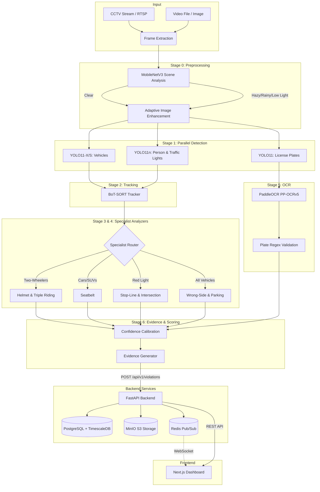

# Gridlock 2.0 — AI Traffic Violation Detection

A production-grade, AI-powered traffic violation detection system purpose-built for Bengaluru (Indian road conditions, Indian vehicles, Indian license plate formats). Built for **Flipkart Gridlock 2.0 (Phase 2)**.

This system processes CCTV feeds at 30+ FPS (GPU) or 5+ FPS (CPU), detects all 8 violation types automatically, and generates tamper-proof evidence packages.

## Features

- **Adaptive Hardware Selection:** Runs YOLO11-X on GPU (6ms) or YOLO11-S on CPU (80ms).
- **Parallel Multi-Model Architecture:** 7 specialist models working in tandem.
- **3-Tier Confidence System:** `AUTO_ENFORCE` (≥0.90), `HUMAN_REVIEW` (0.70-0.90), `LOG_ONLY` (<0.70).
- **Tamper-Proof Evidence:** Annotated image + 3s video clip + SHA-256 hash.
- **Next.js Dashboard:** Real-time violation feeds, analytics heatmap, and officer review queue.
- **Microservices:** FastAPI backend, PostgreSQL + TimescaleDB, Redis, MinIO object storage.

---

## Architecture Diagram

The system employs a 7-Stage Pipeline for end-to-end processing, routing data from CCTV feeds to the final Next.js dashboard.



## Quick Start

See [`plan.md`](plan.md) for detailed execution plans, violation logic, and dataset inventory.

### Running the Project

```bash
# Clone the repository
git clone https://github.com/10vulture1005/grid2.0.git
cd grid2.0

# Install dependencies
python -m venv venv
source venv/bin/activate  # On Windows: venv\Scripts\activate
pip install -r requirements.txt

# Run the complete stack via Docker Compose
docker-compose up --build
```
